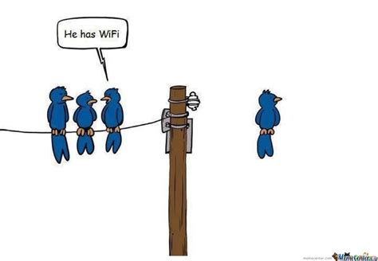

{: .align-right width="300px"}

I am a recent PhD graduate from the Florida State University (Class of 2024), where I worked under the guidance of [Dr. Zhenghao Zhang](https://www.cs.fsu.edu/department/faculty/zzhang/). 

🔬 I have over 6 years of experience in research and software development in the field of cybersecurity, wireless communication, and satellite communication.

📚 I have worked on projects related to starlink and LoRa technology. My most recent project [StarAngle](https://dl.acm.org/doi/10.1145/3666025.3699367), is based on user orientation calculation using the beacon signals transmitted by starlink satellites.

👾 Along with the PhD research, I have always been an active member of the FSU CTF team [Nol3ptr](https://ctftime.org/team/2524/) where we participate in weekly CTF competitions hosted all over the world.

<i>"Where There Is a Will, There Is a Way."</i>  <i>-George Herbert</i>

