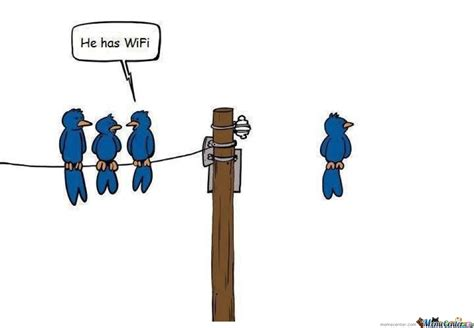

{: .align-right width="300px"}

I am a 4th year PhD student at the Florida State University, set to graduate in December 2024 under the guidance of [Dr. Zhenghao Zhang](https://www.cs.fsu.edu/department/faculty/zzhang/). 

🔬 My research interests are in Wireless Communication, Low Power Wide Area Networks(LPWAN) and Satellite Communication.

📚 I am currently working on localization using [Starlink](https://www.starlink.com/us) signals which is funded by [National Science Foundation](https://news.fsu.edu/news/science-technology/2023/09/11/fsu-computer-scientist-awarded-nsf-grant-to-develop-new-wireless-communications-technology/). 

👾 Along with the PhD research, I am an active member of the FSU CTF team [Nol3ptr](https://ctftime.org/team/2524/) where we participate in weekly CTF competitions hosted all over the world.

*"Where There Is a Will, There Is a Way."*  -George Herbert
